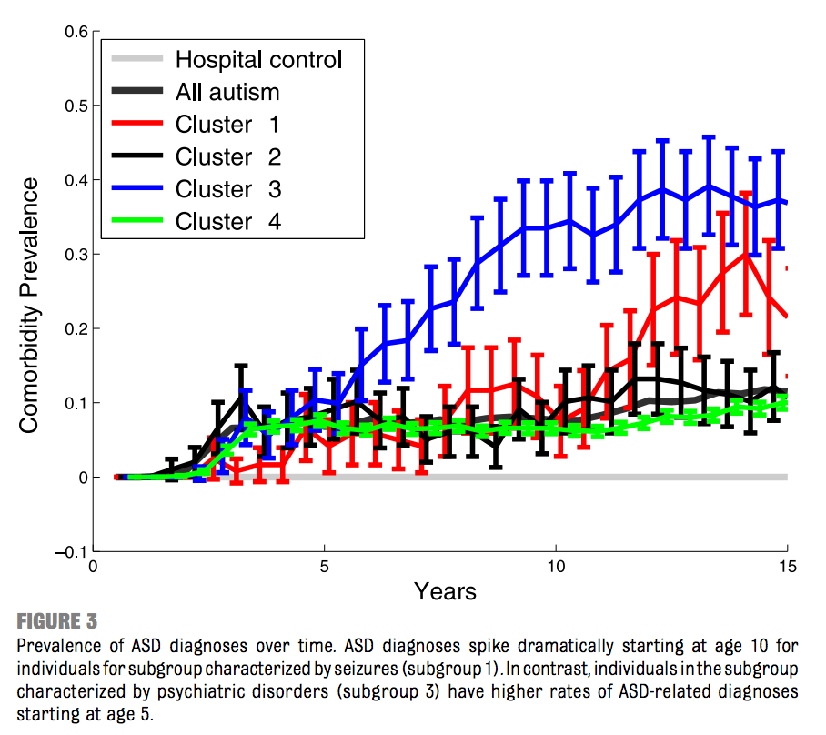

# Comorbidity Clusters in Autism Spectrum Disorders

F. Doshi-Velez, Y. Ge, I. Kohane. [Comorbidity Clusters in Autism Spectrum Disorders: An Electronic Health Record Time-Series Analysis.](http://pediatrics.aappublications.org/content/133/1/e54.full-text.pdf) Pediatrics 2014.

## tl;dr
 - Adolescents with autism spectrum disorders (ASD) can be clustered into 4 groups based on comorbidity
 - Groups include: 1) seizures, 2) multi-system disorders, 3) psychiatric disorders, and 4) everything else
 - Methodology included hierarchical clustering with Ward's method

## Thoughts
Because it's a *Pediatrics* article, the authors focus more on the medical implications and prior medical research on ASD. Personally, I found this much more intriguing, and it underscored the importance of using machine learning and statistics within proper contexts for maximum impact.

The hierarchical clustering methodology was glossed over, and the actual clusters only categorized 12% of the sample size whereas 88% ended up in the "everything else" cluster. Without more medical knowledge, I'm unsure if this paper is a breakthrough in ASD research since the links between ASD and seizures, psychiatric disorders, etc. were already widely known. 

Personally I found the last bit of the paper most surprising including the age of diagnosis for each cluster as well as the fact that the smaller subgroups had 5X more codes (implying higher morbidity). 

Overall, enjoyed this papers as it gave me an insight into how the medical field views statistical methods as useful. This paper's contributions seems to be: 1) using much more data than prior studies by relying on electronic medical records, 2) attempting to untangle the various genetic underpinnings of ASD, and 3) demonstrating the usage of statistical models using medical codes.

## Data
 - 4927 ASD patients, ages 15 or older
 - 1350-dimensional vectors in 6-month blocks from ages 0 to 15

## Method
 - Hierarchical clustering using [Ward's method](https://en.wikipedia.org/wiki/Ward's_method) and Euler distance
 - Clusters constrained to greater than or equal to 2% of population
 - Assessed using chi-squared between code counts in each window and the observed codes for each patient

## Results
 - Four clusters including three smaller clusters with comorbidity tied to 1) seizures, 2) multi-system disorders including gastrointestinal, auditory disorders, and infections, 3) psychiatric disorders
 - Smaller subgroups had 5X rate of medical codes (higher morbidity)
 - Age of diagnosis peaks differently for each smaller cluster, suggesting some predictive elements
 - More detailed breakdown of each cluster--gender, specific codes, etc--in paper

 

## Q's for authors
 - Why only four clusters? What is the stopping criteria and is it specific to Ward's method?
 - What is the hierarchical aspect of these clusters? Model described only one layers of clusters
 - What are "phenotype-wide association studies"? 
 - How does this paper compare to other machine learning applied to healthcare papers? More technical / less technical? Where are the "breakthroughs" supposed to come from?