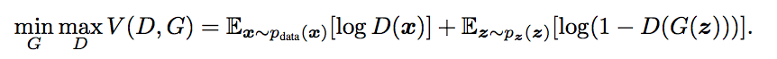

# Generative Adversarial Nets

[Generative Adversarial Nets.](https://arxiv.org/pdf/1406.2661v1.pdf) I. Goodfellow, J. Pouget-Abadie, M. Mirza, B. Xu, D. Warde-Farley, S. Ozair, A. Courville, Y. Bengio. NIPS 2014. 

## tl;dr
 - Introduces new generative model using a discriminative and generative pair: counterfeit money maker gets better by having to evade poilce.
 - 
 - Open question or critique

## Overall Thoughts
Machine learning research moves fast, and as of Jan 2017, generative adversarial nets (GAN) are currently the hottest model around. The idea is simple enough to understand: a money counterfeiter tries to make money that passes off as real, and the police get smarter at detecting counterfeits. 

> "As steel sharpens steel, so man sharpens man."

There's a moral in all of this, but the beauty of the model is also striking in a technical way. A very simple idea allows the generative model to improve greatly--rather than try to fit the probability distributions.

The authors cover two basic sections: theoretical guarantees and empirical results. I especially appreciated the simplicity of the proofs. It's clear that the authors understand how simple and powerful this idea is. This paper is the kind of paper I dream of writing. 

## Theoretical results
 - Global optimality of p_g = p_data where p is the generative probability distributions
 - Algorithm converges: proof given by mapping it to a gradient descent update with convex value function V

## Experimental results
 - Using two networks, rectifier linear activation and sigmoid functions for the generator and maxout activations for discriminator. 
 - Drawn samples (no cherry picking) are matched next to the closest sample. Looks pretty good to me!

## Q's for authors
 - How do you measure generative model performance?

## Helpful links
 - [Video by Siraj Raval](https://www.youtube.com/watch?v=deyOX6Mt_As)
 - [Blog post by KDnuggets](http://www.kdnuggets.com/2017/01/generative-adversarial-networks-hot-topic-machine-learning.html)
 - [Blog post by Eric Jang](http://blog.evjang.com/2016/06/generative-adversarial-nets-in.html)