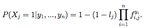

# Learning a health knowledge graph from electronic medical records

Y. Halpern. [Learning a health knowledge graph from electronic medical records.](http://www.cs.nyu.edu/~halpern/files/halpern_thesis.pdf) Ch 5 of PhD thesis, 2016.

## tl;dr
 - Using electronic medical records, the author build three health knowledge graphs for relating symptoms with diagnoses using logistic regression, naive bayes, and noisy or model.
 - The latter two models were surprisingly effective when benchmarked against medical professional responses and the Google Health graph.
 - Possible extensions include allowing symptoms to be connected to each other, combining declarative and statistical knowledge sources (aka modeling noise), and improved concept extraction

## Overall Thoughts

With hospitals across the country putting medical records online within the last decade, the next frontier of medical knowledge may come from machine learning. Prior work includes building knowledge from textbooks, but electronic medical records present the more urgest, rawest form of data. 

In this chapter of his thesis, the author explores building a graph of symptoms and diseases based on electronic medical records using three main models: logistic regression, naive bayes, and noisy or. If the models showed a predictive relationship between the symptom and the disease over some threshold, the edge would exist in the graph.

The chapter describes applying the theoretical to a dataset of 270k emergency department patient visits. Using manual evaluation from physicians and the Google health graph, the author shows that the naive bayes and noisy or models are able to build a reasonably accurate graph. This result shows tremendous possibility in applying it to assist doctors and inform medical diagnoses.

Specifics of the model (e.g. thresholds, entity extraction) are covered more thoroughly in the paper, but since I was suggested to read this by David in order to potentially work on the project, I'm curious more about the extensions and the practicality. Is causality important to prove or are related topics good enough?

## Models
 - *Logistic regression:* If an edge between a symptom and disease has a coefficient above some positive threshold, include in the graph
 - *Naive Bayes:* Importance defined as log p(x_j = 1 | y_i = 1) - log p(x_j = 1 | y_i = 0) where x_j is binary variable for symptom j and y_i is binary variable for disease i
 - *Noisy or:* Given n diseases and m symptoms, disease y_i turns on its chidlren symptoms x_j but fails with probability f_ij. Leak probability l_j is the probability that a symptom appears even with all diseases off. Importance measure is 1 - f_ij. Probability of a symptom being present is then:

 

## Extensions
 - *Data refinement:* concept extraction and other data cleanliness
 - *More robust model:* edges between symptoms, bringing in multiple sources of truth (textbooks, EMRs, etc), building in noise generally
 - *Transfer learning:* Can this apply to areas beyond knowledge graphs? acute care?
 - See also [writeup on Ch 6 of thesis](Halpern_ch6.md)