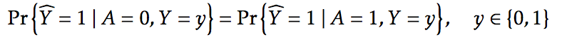

# Equality of Opportunity in Supervised Learning

M. Hardt, E. Price, N. Srebro. [Equality of Opportunity in Supervised Learning.](https://arxiv.org/pdf/1610.02413v1.pdf) NIPS 2016. 

## tl;dr
 - Equalized odds presents a new way of formalizing a non-discriminatory predictive algorithm
 - Takeaway 2
 - Open question or critique

## Overall Thoughts

With the rise of machine learning, there has come the backlash of discrminatory algorithms. Certainly no one wants to be accused of bias (either intentional or unintentional), and thus a new field of "fair" algorithms has been born. As with any new field, the definition themselves must be carefully constructed and ruthlessly tested. 

On a personal note, I've found the thorny topic of bias and discimination fascinating through my work with gender and racial bias on Airbnb as well as my work with women in STEM. Most often, bias is not intentional but rather the result of negligence and lack of formalization. If you "go from the gut," there is more room for error. How can we structure our models, our systems, and our lives to be fair to all?

Let Y (e.g. likelihood to be arrested) be the attribute to be predicted from features X (e.g. prior record, hair color, etc). 

One naive method would remove the protected attribute A entirely. This does not solve anything since there might still be latent factors. Another slightly more clever method, which sets the  P(Y = 1 | A = 0) = P(Y = 0 | A = 1), is that it makes the possibility that A is perfectly correlcted with Y impossible. Here with equalized odds, we require that the model be *oblivious* but not *blind*. 

Here the authors formalize their concept of *equalized odds*: essentially the true positive and false negative rates must be equal for a protected attribute A. 

A weaker notion of *equal opportunity* for only the situation where y = 1. That is, if we assume binary predictors tend to be positive (e.g. should this person get into this school), then the people who will do well have an equal opportunity to get into the school.

Slightly more formally, we construct a predictor Y_tilda that is independent of X conditional on random variables R and protected attribute A. The rest of the paper goes about applying this to real valued predictors, Bayes optimal predictors, and empirical results.

Truthfully I read this paper over twenty times and got backed up on my future papers to read because it was so fascinating. I could see myself focusing large amounts of research time onto questions of equality and fairness in algorithms.

## Helpful
 - [Google blog post](https://research.googleblog.com/2016/10/equality-of-opportunity-in-machine.html)