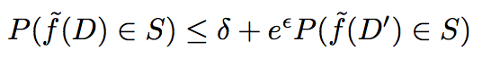

# Differential Privacy and Machine Learning: a Survey and Review

Zhanglong Ji, Zachary C. Lipton, Charles Elkan. [Differential Privacy and Machine Learning: a Survey and Review.](https://arxiv.org/pdf/1412.7584.pdf) Dec. 2014.

## tl;dr
 - DP is popular definition of privacy, making a mechanism robust to a change
 - LaPlace and Gaussian noise can be added to make a query DP-safe
 - ML algorithms can be modified to do so, potentially for free

## Definitions
**Differential privacy** requires a mechanism outputting information about a dataset be robust against any change of one sample.

By this definition, **delta** refers to the confidence level (if delta > 0, the mechanism leaks information) whereas **epislon** refers to the level of privacy protection. Epislon is also called the privacy budget and may be split up among the different steps of a mechanism.

The **sensitivity** of a query is defined as the maximum distance between f(D) and f(D') where D and D' differ by 1. The normalizing function can be L1 or L2.

The **Laplacian mechanism** adds noise distributed Laplacian aka exp(-eps / S) where S is the sensitivity. This satisfies epsilon-privacy (aka delta = 0). A similar mechanism can be built for Gaussian noise, but that only preserves differential privacy for delta > 0.

The paper also discusses **local sensitivity**: given a dataset D, find the D' that maximizes distance of query f(D) and f(D'). We have a problem where attackers can infer whether or not the dataset is D or D' based on the distance between f(D) and f(D') since D can have a small local sensitivity and D' can have a larger one. The **smoothening sensitivity** smooths the scale of noise across neighboring datasets.

Lastly, the **sample and aggregate** framework samples the dataset D and calculates f on various subsets. We then find the nearest neighbor for each f(D_i) over roughly half of the options and smooth to ensure differential privacy.

## Machine Learning methods
 - Supervised: Naive Bayes, linear regression, linear SVM, logistic regression, kernel SVM, decision tree, online convex programming
 - Unsupervised: K-means
 - Dimensionality reduction, PCA

## Four main ideas to reduce noise while still achieve DP
 - add noice once instead of every round
 - lower global sensitivity
 - public information can help
 - iterative noise addition