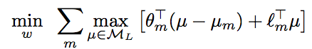

# Train and Test Tightness of LP Relaxations in Structured Prediction.

O. Meshi, M. Mahdavi, A. Weller, D. Sontag. [Train and Test Tightness of LP Relaxations in Structured Prediction.](http://cs.nyu.edu/~dsontag/papers/MeshiEtAl_icml16.pdf) ICML 2016.

## tl;dr
 - Linear programming (LP) can be used for prediction tasks; relaxations allow integer linear programming (ILP) tasks to be solved as if non-integer; relaxations may yield exact result, meaning they are tight
 - Authors explain the tightness of LP relaxations in theoretical framework for train data (byproduct of training objective) and test data (generalized bound for tightness)
 - Very theoretical but interesting. Would need to grapple more with the math

## Overall Thoughts
Linear programming remains one of my favorite areas of applied math, and the connection between prediction tasks and LPs is super interesting. The relaxation of bounds in prediction problems additionally combines the beauty of approximation with the theoretical guarantees that make math useful. 

For a specific prediction task formulation, the authors show bounds on both the train data relaxation (integrality gap and exact-hinge) and the test data (proving that if the train data is tight, the test data relaxation is tight). 

I wish I understood more of the math, and after puzzling over a few hours, I am able to grasp the basics of what is being proven. Will have to revisit for future work in this area.

## Problem formulation
The ILP to solve involves the linear classifier prediction problem of mapping real-valued x to discrete output y. Weights w are learned from the training data set. Lambda refers to an indicator variable about whether or not y is active for that factor (splitting objective function into edges and nodes for example), and l is the task-specific loss.

## Tightness of training
Here we can decompose the "relaxed-hinge" to the integrality gap and the exact-hinge. The authors show an upper bound to the integrality gap while also arguing that minimizing the training objective will also reduce the hinge term. 

More detailed proof available in paper.

## Tightness generalization
In order to prove test tightness, the authors show that train tightness implies test tightness using the [Rademacher complexity](https://en.wikipedia.org/wiki/Rademacher_complexity)

Here the paper presents multiple theorems that I did not quite follow.

## Q's for authors
 - phi(x,y') maps input-output pairs to features vectors. What are the feature vectors?